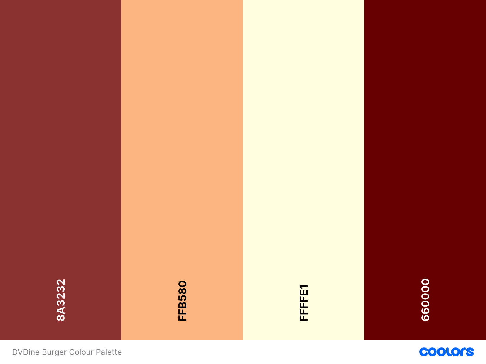
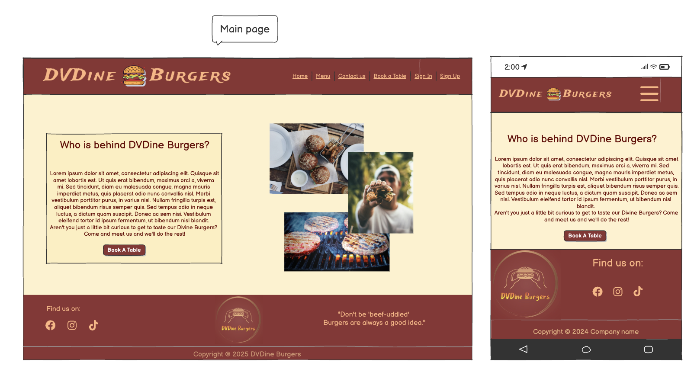
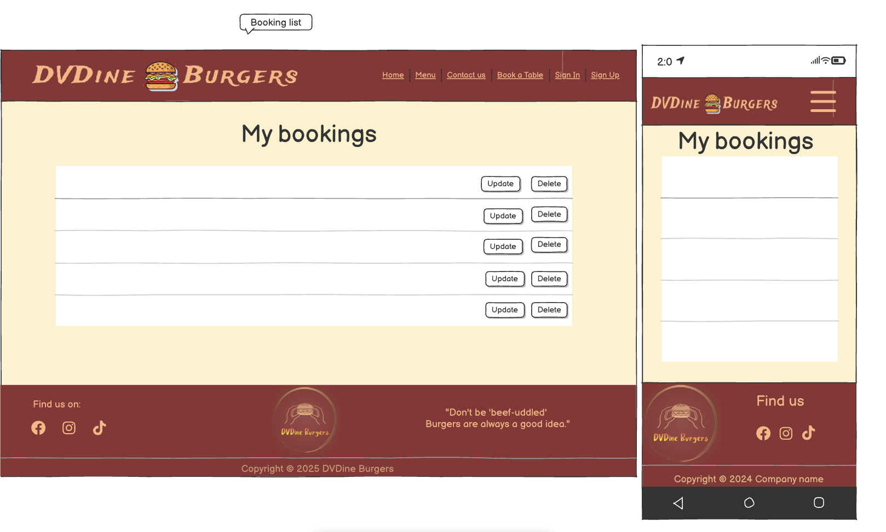

# DVDine_Burgers

DVDine Burgers is a burger focused fictional establishment located in Hereford, UK. 
This site is my dream come true one day, for the love of making and eating burgers. I must say it is not my merit, as I have been taught by my husband, who is the burger master.
This was designed to allow potential clients the ability to acces info regarding the restaurant, and manage bookings. Also, featuring an administrative area, allowing the managers to check and plan the bookings of all users, so that they can properly run the restaurant.


## [View DVDine Burgers live website on Heroku](https://dvdine-burgers-140c23a3ed2a.herokuapp.com/)

## CONTENTS

- [User Experience](#user-experience)
  - [Milestones & User Stories](#milestones--user-stories)
    - [Milestone 1 - Navigate site pages](#milestone-1---navigate-site-pages)
    - [Milestone 2 - Booking System](#milestone-2---booking-system)
    - [Milestone 3 - Sign up/Sign in/ Log out](#milestone-3---sign-upsign-in-log-out)
    - [Milestone 4 - Additional coding](#milestone-4---additional-coding)
    - [Milestone 5 - CRUD functionality](#milestone-5---crud-functionality)
- [Scope](#scope)
- [Design](#design)
  - [Colour Scheme](#colour-scheme)
  - [Typography](#typography)
- [Features](#features)
  - [Skeleton](#skeleton)
  - [Database](#database)
  - [Features Implemented](#features-implemented)
    - [Navbar](#navbar)
    - [Home Page](#home-page)
    - [Menu page](#menu-page)
    - [Booking landing page](#booking-landing-page)
    - [Booking list page](#booking-list-page)
    - [Contact page](#contact-page)
    - [Footer](#footer)
    - [Booking, Update, Delete forms Modal](#booking-update-delete-forms-modal)
    - [Booking overview for Admin](#booking-overview-for-admin)
    - [Errors](#errors)
    - [Features to be implemented](#features-to-be-implemented)
- [Technology & Resources](#technology--resources)
- [Testing](#testing)
- [Deployment](#deployment)
  - [Heroku Deployment](#heroku-deployment)
  - [Forking](#forking)
  - [Cloning](#cloning-the-repositoryrunning-locally)
- [Credits](#credits)

---

## User Experience 

With the site's user-friendly layout, clients can readily find the restaurant's opening and closing times, menu, and location. They can also make, view, edit, and delete bookings with ease.
There is a private section of the site that only the restaurant management or site administrator can access via https://dvdine-burgers-140c23a3ed2a.herokuapp.com/admin

### Milestones & User Stories

There are five Milestones (epics) that were considered while making this project. Each have its own user stories detailed in [GitHub Projects Kanban Board](https://github.com/users/CristianaDvD/projects/6).


#### Milestone 1 - Navigate site pages

- 1.1 - User Story: As a Site User/Visitor I can access main page and nav bar links so that I can learn more about the restaurant.
- 1.2 - User Story: As a Site User/Visitor I can access the Menu page so that I can see food options.
- 1.3 - User Story: As a Site User/Visitor I can see restaurant contact options and location so that I can plan future visits and know how to get in touch.

#### Milestone 2 - Booking System

- 2.1 - User Story: As a Site User/Visitor I can see the booking options so that I can arrange for a visit.
- 2.2 - User Story: As a Site User I can see all my bookings in one place so that I remind myself of any details.

#### Milestone 3 - Sign up/Sign in/ Log out

- 3.1 - User Story: As a Site User/Visitor I can create a profile user so that I can make/view/update my bookings.
- 3.2 - User Story: As a Site User/Visitor I can sign in/log out my account so that I can be the only one having access to my bookings.

#### Milestone 4 - Additional coding

- 4.1 - User Story: As a Site Admin I can arrange for bookings availability so that bookings are not made when restaurant is closed.
- 4.2 - User Story: As a Site User I can see screen confirmation after registration/log in/ booking made so that I know the status of my input.
- 4.3 - User Story: As a Site User/Visitor I can Error pages so that I can safely return to home page.
- 4.4 - User Story: As a Site User/Visitor I can see a nicely styled website so that my interest to know more about it, grows.

#### Milestone 5 - CRUD functionality

- 5.1 - User Story: As a Site Admin I can see bookings requests and a list of existing ones so that I can confirm/delete them, in order to plan required tables for the day(s).
- 5.2 - User Story: As a Site User I can make an online booking so that I can secure a table for a particular date, time, number of guests, special requests.
- 5.3 - User Story: As a Site User I can view my bookings so that I can see status of each and details.
- 5.4 - User Story: As a Site User I can modify or delete my bookings so that the restaurant can update its database and I can correct it to suit my needs.

## Scope

Using these milestones, goals, and stories to guide my thinking, the following was planned as the Scope of the project:

- Responsive Design allowing full functionality and appropriate resizing on all devices from 320px upwards
- Use of Toggle-menu and hidden elements (e.g. home page image) when site is viewed on tablet/mobile devices
- A main section of the site containing all restaurant information (non-restricted access):
  - Opening Times
  - Menu
  - Location
- A booking section of the site allowing CRUD functionality for end users (restricted access):
  - Sign Up/In/Out
  - Make Bookings
  - View Bookings
  - Modify Bookings
  - Cancel Bookings
- An admin backend to the site allowing CRUD functionality for site admin (restricted access):
  - View All Bookings
  - Confirm Bookings

## Design

### Colour Scheme

The website uses a colour palette to match with the majority of images used. The colour palette was created using the [Coolors](https://coolors.co/) website.



### Typography 

Google Fonts was used for the following fonts:
  - Playpen Sans, a sans serif font, was used for the overal text of the site.
  - Atma, a sans serif font, was used for the headings and titles of the site.
  Both ofer a playfull, attracting view for the users.

## Features

With Strategy and Scope now in place, focus shifted to setting acceptance criteria for each of the above, thereby informing exactly what features to include as part of the project. These acceptance criteria were added to each Dev Goal and User Story on the aforementioned Kanban board to act as an insurance that task would be completed to the fullest extent needed.

| Milestone | Ref | Type | Acceptance Criteria |
| --- | --- | --- | --- |
| Milestone 1 - Navigate site pages | [1.1](#milestone-1---navigate-site-pages) | User Story | <ul><li>Create main page displaying info about the restaurant.</li><li>Main page to display nav bar with links to other site pages.</li><li>Main page to display footer with social media links icons.</li></ul> |
| Milestone 1 - Navigate site pages | [1.2](#milestone-1---navigate-site-pages) | User Story | <ul><li>Menu page to open when link from nav bar is clicked.</li><li>Create menu html with food options, including description, price and maybe foto.</li><li>Include possible allergens as a note at the bottom of the page.</li></ul> |
| Milestone 1 - Navigate site pages | [1.3](#milestone-1---navigate-site-pages) | User Story | <ul><li>Contact us page to open when nav bar link is clicked</li><li>Display contact info such as email address, phone number</li><li>Display opening/ closing times</li><li>Display address on map</li></ul> |
| Milestone 2 - Booking System | [2.1](#milestone-2---booking-system) | User Story | <ul><li>Create html file to display book a table page.</li><li>Create form to display date/time/guest number and additional requests.</li><li>In order to book a table, users have to sign up.</li><li>Display booking status as a feedback submission.</li><li>Display logged user name.</li></ul> |
| Milestone 2 - Booking System | [2.2](#milestone-2---booking-system) | User Story | <ul><li>Create separate page to list all bookings for every user.</li></ul> |
| Milestone 3 - Sign up/Sign in/ Log out | [3.1](#milestone-3---sign-upsign-in-log-out) | User Story | <ul><li>Create Sign up form with email address/ user id/ password.</li></ul> |
| Milestone 3 - Sign up/Sign in/ Log out | [3.2](#milestone-3---sign-upsign-in-log-out) | User Story | <ul><li>Create sign in page after user id has been created</li></ul> |
| Milestone 4 - Additional coding | [4.1](#milestone-4---additional-coding) | User Story | <ul><li>The option to only select when restaurant is opened.</li><li>The option to only choose between the working hours.</li><li>The option to only select a number of guests from 1 to 10.</li></ul> |
| Milestone 4 - Additional coding | [4.2](#milestone-4---additional-coding) | User Story | <ul><li>Confirmation message for booking made/modified/cancelled.</li></ul> |
| Milestone 4 - Additional coding | [4.3](#milestone-4---additional-coding) | User Story | <ul><li>Create 403 page with link to return to home page.</li><li>Create 404 page with link to return to home page</li><li>Create 500 page with link to return to home page</li></ul> |
| Milestone 4 - Additional coding | [4.4](#milestone-4---additional-coding) | User Story | <ul><li>Create style.css file to style all website pages for better UX</li><li>Pick colour palette for website design</li><li>Display logo1 at navbar and logo2 at footer</li><li>Arrange all pages to match the overall design of the website</li></ul> |
| Milestone 5 - CRUD functionality | [5.1](#milestone-5---crud-functionality) | User Story | <ul><li>Create booking model to be seen in the admin panel.</li><li>Add status of bookings made.</li><li>Add guest number range available for bookings at a table.</li><li>See a list of all existing bookings</li><li>Add dropdown option to manage bookings</li></ul> |
| Milestone 5 - CRUD functionality | [5.2](#milestone-5---crud-functionality) | User Story | <ul><li>A booking form with date, time, special requests and number of guests.</li><li>Add status of bookings made.</li><li>A link button for logged in user to redirect to current/past bookings.</li></ul> |
| Milestone 5 - CRUD functionality | [5.3](#milestone-5---crud-functionality) | User Story | <ul><li>A list of bookings after the user have submitted a valid booking form.</li></ul> |
| Milestone 5 - CRUD functionality | [5.4](#milestone-5---crud-functionality) | User Story | <ul><li>Buttons for each booking to Modify/ Cancel booking if necessary.</li><li>The option to return to the list without any changes, after any button is clicked.</li><li>Update changes in the database after users confirms them.</li></ul> |

### Skeleton

After settling on a set of features, the next step was to visualize their implementation using a wireframing tool and a database design program, respectively, before committing the design to code.
All of the site-design frames which follow can be viewed on one page [using the following link](https://balsamiq.cloud/s4wptm3/pki6il4/r4DCC)

#### Wireframes 
- Home 

- Menu 

- Contact

- Booking Landing page and modal opening upon clicking the buttons

- Booking List Page


### Database
The [database model](https://lucid.app/lucidchart/1c0facd8-f1a5-47b1-a7d1-fa7fd09c444f/edit?beaconFlowId=8BA407DDB50C273C&page=0_0&invitationId=inv_59d090dc-3d25-4c13-a28d-97538480b2c8#) was designed by one model.


### Features implemented

#### Navbar
A navbar providing clear links to the other pages of the site, and one of the logos displayed to the left.


#### Home Page

Home page displaying an intro about DVDine Burgers and a collage photo to make it more attractive, plus button for new booking. 

 

#### Menu page

A menu page is accessible clicking the navbar link. We have starters, burgers, deserts and drinks, all displayed on different pages.

  

#### Booking landing page

A landing booking page is available without restrictive condition such as having an account.

 

#### Booking list page

A booking list is accessible to the user to see, update or delete existing bookings.

 

#### Contact page

Contact page is displaying opening hours, ways of communicate with the restaurant and location via google maps.

 

#### Footer 

In the footer we find the social media icons that open in a seprate tab, along the second logo of the business, and a quote visible only on medium and larger screens.


#### Booking, Update, Delete forms Modal

Modals open after clicking the buttons accordingly.

 


#### Booking overview for Admin

As mentioned previously, the website gives access to the administrator to see, update, modify or delete bookings.

 

#### Errors

Errors are very easy to be done, so we have error messages displayed when it is the case, as follows.


And we also have customised 403, 404 and 500 error pages, all customised as per 404 page below


#### Features to be implemented

- To add prices to menu items and display them on the menu page.
- To block out dates and times unavailable.
- Reminders for bookings sent ot customers.
- Email confirmation for booking being accepted.

## Technology & Resources

  Technologies used:
  - Python Modules
    - asgiref==3.9.1
    - bleach==6.2.0
    - certifi==2025.7.9
    - cffi==1.17.1
    - charset-normalizer==3.4.2
    - cloudinary==1.36.0
    - crispy-bootstrap5==0.7
    - cryptography==45.0.5
    - defusedxml==0.7.1
    - dj-database-url==0.5.0
    - dj3-cloudinary-storage==0.0.6
    - Django==4.2.23
    - django-allauth==0.57.2
    - django-crispy-forms==2.4
    - django-summernote==0.8.20.0
    - gunicorn==20.1.0
    - idna==3.10
    - oauthlib==3.3.1
    - psycopg2-binary==2.9.10
    - pycparser==2.22
    - PyJWT==2.10.1
    - python3-openid==3.2.0
    - requests==2.32.4
    - requests-oauthlib==2.0.0
    - setuptools==80.9.0
    - six==1.17.0
    - sqlparse==0.5.3
    - urllib3==1.26.20
    - webencodings==0.5.1
    - whitenoise==5.3.0
- [Django](https://www.djangoproject.com/)
  - Used as the main Python framework in the development of this project
  - django-allauth is employed as the means of managing user accounts used for the booking system 
- [Heroku](https://heroku.com)
  - Used as the cloud-based deployment platform for this project
- [PostrgreSQL](https://dbs.ci-dbs.net/)
  - Used as the database hosting service
- HTML
  - Used as the base coding language for templates and site content
- [Bootstrap](https://getbootstrap.com/)
  - Used as the main means of design layout and formatting throughout the site
- CSS
  - Used to modify Bootstrap behaviour where required and create additional custom stylings
- JavaScript
  - Used to create modals for new booking, update and delete booking.

  Packages used:
- [VS Code](https://code.visualstudio.com/) used to code the site and transfer files between the editor and the repository
- [GitHub](https://github.com) used to store the files for this project
- [Google Maps](https://www.google.com/maps) used to create the specific map for the Location page
- [Google Fonts](https://fonts.google.com/) used to style the text throughout the site
- [Coolors](https://coolors.co/) used to help create the colour scheme
- [Markdown Table Generator](https://jakebathman.github.io/Markdown-Table-Generator/) used to create tables for documentation
- [Balsamiq](https://balsamiq.com/) used to develop the wireframe models for the site design
- [Lucidchart](https://lucid.app/documents#/home?folder_id=recent) to create ER diagram for the model used.

  Reference Materials
- [Django documentation](https://docs.djangoproject.com/en/4.2/ref/class-based-views/generic-editing/) referenced frequently in order to achieve CRUD functionality and associated views
- [Django-allauth documentation](https://docs.allauth.org/en/latest/) referenced frequently in order to implement its features correctly
- [Code Institute](https://codeinstitute.net/) course materials and walkthrough projects provided many reference points for implementing features of this project

## Testing
Manual and automated testing undertaken for this project can be viewed in the separate [TESTING.md file](TESTING.md) as follows:

- [Introduction](#dvdine_burgers--testing)
- [Manual Testing](#manual-testing)
  - [Navigation](#navigation)
  - [Responsiveness](#responsiveness)
  - [Authentication](#authentication)
  - [CRUD functionality](#crud-functionality)
- [Validator Testing](#validator-testing)
  - [W3C](#w3c)
  - [PEP8](#pep8)
  - [JSHint](#jshint)
- [Accessibility & Performance](#accessibility--performance)
- [Bugs](#bugs)

## Deployment

### Heroku Deployment

This site was deployed to and is currently [hosted on the Heroku platform](https://dvdine-burgers-140c23a3ed2a.herokuapp.com/). The steps for deploying to Heroku, using PostgreSQL as the database host, are as follows:
#### PostgreSQL Setup
1. Navigate to [PostgreSQL from Code Institute](https://dbs.ci-dbs.net/)
2. Enter your student email address in the input field provided.
3. Click Submit.
4. Wait while the database is created.
5. Your database is successfully created! Please review the email sent to your student email inbox.
#### Django Project Settings
6. Return to your workspace and open the myproject/settings.py file. Change the value of DEBUG back to True as this will ensure that you get detailed errors to ease debugging during development.
7. Create a file named env.py at the top level of the project. You can either create a new file in the file structure or use the terminal command *touch env.py*
8. Open the .gitignore file and add env.py to prevent the secret data you will add to it from being pushed to GitHub.Note: If you have used a codeinstitute template then it will be there already.
9. In your newly created env.py file, import Python's operating system module and use it to set the value of the DATABASE_URL constant to the URL in the email you received from PostgreSQL from Code Institute.
``` 
import os
os.environ.setdefault(
    "DATABASE_URL", "<your-database-URL>")
```
10. Pip install the two packages required to connect to your PostgreSQL database. Then add them to the requirements file:
```
pip3 install dj-database-url~=0.5 psycopg2~=2.9
pip3 freeze --local > requirements.txt
```
11. In myproject/settings.py, import the appropriate packages (Note: You will use dj_database_url in a later step). Now we connect the settings.py file to the env.py file:
```
import os
import dj_database_url
if os.path.isfile('env.py'):
    import env
```
12. Next in the settings.py file, we need to comment out the local sqlite3 database connection.
Note: Django provides this local sqlite3 database by default for development, but we are going to go with a production-ready PostgreSQL cloud database instead.
13. Then, in the settings.py file, connect to the environment variable DATABASE_URL you previously added to the env.py file:
```
DATABASES = {
    'default': dj_database_url.parse(os.environ.get("DATABASE_URL"))
}
```
14. Now that your project is connected to the database, you can create database tables with Django's migrate command:
```
python3 manage.py migrate
```
15. Commit and push these changes to the repository.
#### Heroku Setup
16. Navigate to [Heroku](https://heroku.com) and create an account/log in
17. Click 'New' in the top right and select 'Create New App'
18. Enter an App name (must be unique), choose a region, and then click 'Create app'
19. Select 'Settings' in the menubar
20. Click 'Reveal Config Vars' and add the following:<br>
    - DATABASE_URL: the DATABASE_URL copied from PostgreSQL<br>
    - SECRET_KEY: The SECRET_KEY string you created<br>
21. Click 'Deploy' in the menubar tab then 'GitHub' under 'Deployment method'
22. Select the repository you want to deploy and click 'Connect'
23. Scroll down and click 'Deploy Branch' to complete the process

### Forking
1. Login to/create your [GitHub](https://github.com) account
2. Navigate to the DVDine_Burgers GitHub Repository: https://github.com/CristianaDvD/DVDine_Burgers 
3. Towards the top right, under the main banner, click 'Fork'
4. Adjust the form fields if desired, then click 'Create fork' to finish

### Cloning the Repository/Running Locally
1. Login to/create your [GitHub](https://github.com) account
2. Navigate to the DVDine_Burgers GitHub Repository: https://github.com/CristianaDvD/DVDine_Burgers 
3. Click the '<> Code' dropdown button and ensure 'HTTPS' is selected
4. Click the copy icon (two overlapped squares) beside the repository URL
5. Open your local IDE and create a new project, ensuring git is installed
6. Run ```git clone copied-git-url``` in the terminal to finish.

## Credits

- [Link for photos on home page](https://www.pexels.com/search/burger/)
- [Link for logo at navbar](https://www.vistaprint.co.uk/logomaker)
- [Link for quote at footer](https://pos.toasttab.com/blog/on-the-line/burger-quotes-and-captions#:~:text=%22I'm%20not%20a%20veggie,on%20the%20joy%20of%20burgers.%22)
- [Link to get weekdays and create function for raising error if booking made on closed day](https://www.geeksforgeeks.org/python/weekday-function-of-datetime-date-class-in-python/)
- Photos used on the carousel:
  - https://www.freepik.com/free-photos-vectors/family-eating-burger
  - https://www.gettyimages.in/videos/family-meeting-with-kids?page=2
  - https://www.burger-group.com/en/careers/burger-group-plus/
  - https://www.propertyfinder.ae/blog/burger-restaurants-dubai/
  - https://eu.rgj.com/story/life/food/2015/09/22/things-never-order-business-meal/72593930/
  - https://www.newmarkettoday.ca/local-news/match-made-in-heaven-big-rad-burger-joins-newmarket-craft-beer-bar-6898457
- [Link inspo for modal using java, ajax, and bootstrap](https://www.tutorialrepublic.com/codelab.php?topic=bootstrap&file=loading-content-in-modal-body-via-ajax-using-javascript)
- [Link for starters menu](https://www.bbcgoodfood.com/howto/guide/simple-starter-ideas)
- [Link for burger menu](https://thebeefyboys.com/menu/)
- [Link to check site is responsive](https://ui.dev/amiresponsive)


