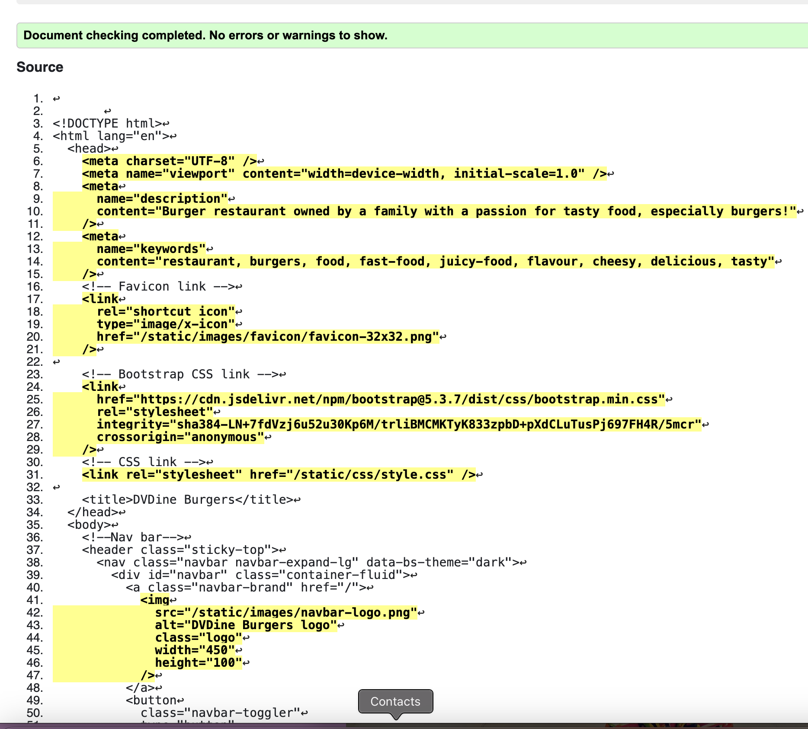

# DVDine_Burgers : Testing

_Note: this document only contains testing info for the EastSt. site. If you require full documentation please [click here to access the README.md](README.md) file_

## Contents
- [Introduction](#dvdine_burgers--testing)
- [Manual Testing](#manual-testing)
  - [Navigation](#navigation)
  - [Responsiveness](#responsiveness)
  - [Authentication](#authentication)
  - [CRUD functionality](#crud-functionality)
- [Validator Testing](#validator-testing)
  - [W3C](#w3c)
  - [PEP8](#pep8)
  - [JSHint](#jshint)
- [Accessibility & Performance](#accessibility--performance)
- [Bugs](#bugs)

## Manual Testing

The following sections list a number of manual tests undertaken to ensure the site operates accordingly.

### Navigation

These tests ensure that a user can successfully navigate the site using the provided navbar links, buttons, and footer icons.
| Feature | Expected Outcome | Testing Performed | Result | Pass/Fail |
| --- | --- | --- | --- | --- |
| Home page | Render home page | Click home nav bar link | Home page displays | Pass |
| Menu page | Render menu page | Click menu nav bar link | Menu page displays | Pass |
| Contact page | Render contact page | Click contact nav bar link | Contact page displays | Pass |
| Book a table page | Render booking landing page | Click book a table nav bar link | Booking landing page opens | Pass |
| Sign In page | Opens signin in form to sign in existing user | Click sign in nav-bar link. Click sign in buttons/links | Form to sign in opens up | Pass |
| Sign Up page | Opens sign up form for users to register | Click sign up nav bar link and buttons | Opens sign up page | Pass |
| Log out page | Opens new page confirming with the user the action | Click log out nav bar link or buttons | Log out page displays | Pass |
| New booking form | Opens in modal in user is signed in | Click book a table button on home page, click make new booking button on booking page, click make a new booking button on booking list page | Opens in modal booking form | Pass |
| Booking list | Opens in separate page, if user signed in | Click on view bookings button from the book a table landing page. | Booking list page displayed. | Pass |
| Update modal | Opens when user clicks update button displayed in booking list table. | Click update button on an existing available booking. | Update modal opens booking form with pre-existing info | Pass |
| Delete modal | Opens when user clicks delete button displayed in booking list table. | Click delete button on an existing available booking. | Delete modal opens correctly | Pass |
| Facebook icon | Opens in a separate tab | Click footer icon for facebook | Opens facebook page in a separate tab | Pass |
| Instagram icon | Opens in a separate tab | Click footer icon for instagram | Opens instagram page in a separate tab | Pass |
| TikTok icon | Opens in a separate tab | Click footer icon for tiktok | Opens tiktok page in a separate tab | Pass |
| Nav bar logo | Redirects to home page | Click on nav bar logo from every page | Displays home page | Pass |
| Menu page buttons for pagination | Displays starters, or burgers, deserts or drinks when buttons clicked | Click buttons to choose what menu to display | Opens correct menu page | Pass |
| Admin page | Opens admin page via django libraries | Type admin into the https://dvdine-burgers-140c23a3ed2a.herokuapp.com/admin into the browser. Hit Enter. Sign in superuser details. | Admin page displays with Booking system details in left-hand menu | Pass |

### Responsiveness

These tests check that the site responds correctly at various sizes of screen, resizing, hiding, and reformatting elements where necessary.

| Feature | Expected Outcome | Testing Performed | Result | Pass/Fail |
| --- | --- | --- | --- | --- |
| Navbar toggler | Appears at screens smaller than 767px | Navigate to all pages via dev tools from small to large screens to assure navbar toggler works correctly. | Navbar toggler appears on screens smaller than 767px | Pass |
| Home page on small screens | Home page image is hidden on medium and small screens. Page renders correctly. | Open home page in dev tools and go over all screen options. | Page is scrollable and all content is shown. Image is hidden on medium and small screens and re-appears on larger screens. | Pass |
| Menu page on small screens | Menu page displays one column with 4 cards per page in small screens, goes to 3 columns on medium screens and 4 columns on larger screens. | Open menu page in dev tools and go over all screen options. | Page is rendered correctly in all screen sizes. | Pass |
| Contact page on small screens | Displays one column on small screens and 2 cols on medium and larger screens | Open contact page in dev tools and go over all screen options. | Page works accordingly in all screen sizes | Pass |
| Book a table | Hide carousel on small and medium screens, and display from large. | Open book a table page in dev tools and go over all screen options. | Page works accordingly in all screen sizes | Pass |
| Booking list | Booking list table goes smaller and update and delete buttons display one above the other and all info readable. | Open booking list page in dev tools and go over all screen options. | Page works accordingly in all screen sizes | Pass |
| Navbar and footer on small screens | Quote on footer gets hidden on small screens, logo navbar adjusts size as per styling. | Open any page in dev tools and go over all screen options. | Navbar and footer works accordingly in all screen sizes | Pass |

### Authentication

These tests check the sign up, sign in, and sign out functionality of the site which are essential for secure access to the booking area.

| Feature | Expected Outcome | Testing Performed | Result | Pass/Fail |
| --- | --- | --- | --- | --- |
| Sign In without an existing account | site displays error, asking user to go to sign up page, if doesn't have an account yet | Input invalid credentials | Page displays error as expected. | Pass |
| Sign in with existing account | Home page opens in the server | Sign in with valid credentials | Home page opens up. | Pass |
| Sign in with wrong password | Site displays error password doesn't match | Input wrong password for an existing username | Page displays error as expected. | Pass |
| Sign Up with previously registered username | Site displays error, username exists already | Try to sign up with existing username | Site displays error as expected. | Pass |
| Sign Out | User scan safely sign out from the site | Open log out page | Page with sign out button and go to home page buttons is displayed. When sign out button is clicked, server redirects to home page | Pass |

### CRUD Functionality

These tests determine if a user is able to successfully create, view, update and/or delete a booking, or not as the case may be, through the front-end capabilities of the site. In all test cases, **one must first sign in** to the booking area of the site before completing any of the other steps listed.

- 'Date' is not left blank
- 'Time' is not left blank
- 'Date' cannot be set on Monday
- 'Time' for Tue-Thur cannot be later than 9

| Feature | Expected Outcome | Testing Performed | Result | Pass/Fail |
| --- | --- | --- | --- | --- |
| Book/Update/Delete table if signed in user | Create new booking/ Modify/Delete existing bookings | Sign in, go to book a table/update/delete a booking, input valid choices | Booking created/updated/deleted. | Pass |
| Book on a Monday | Error shown on modal, form not submitted, reload modal | Open booking form, try to book on a Monday | Error shown and modal reloads empty. | Pass |
| Book/Modify on Tue-Thu later than 9pm | Error shown on modal, form not submitted, reload modal | Open booking/updating form and try to choose between Tue-Thu any time later than 9pm | Error shown as expected, modal reloads. | Pass |
| Modify Cancelled/ Rejected booking | Not permitted. No buttons shown, instead `No actions available` displayed. | Go on my bookings and try to modify/ delete existing bookings already cancelled. | No buttons shown | Pass |
| Modify booking | Existing booking goes to pending after modification. | Go to my bookings list and modify any valid bookings. | Status goes to pending | Pass |
| Delete booking | Signed in user can safely delete any valid bookings. | Go to my bookings list and delete any valid bookings. | Booking modal opens up for user to delete or cancel this action. | Pass |
| Admin manage bookings | Admin can update any valid submitted booking. | Go to admin site (as shown previously) and change status on valid bookings | Booking/s updated accordingly | Pass |

## Validator Testing

### W3C

All pages have been passed through the [W3C HTML Validator](https://validator.w3.org/) successfully. 
Also style.css have been passed thru [W3C CSS Validator](https://jigsaw.w3.org/css-validator/).

CSS Check:

HTML Check:
- Home Page

- Menu Page

- Contact Page

- Booking list

- Booking page is throwing the following error, however, after manually checking and formatting with Prettier, no such div with missing tag, has been found.

### PEP8

All Python files in the project and its app have been passed through [PEP8 Validator](https://pep8ci.herokuapp.com/). All errors are due to lines being too long and not being able to shorten them. Other than that, all python code looks clean and correct.

### JSHint

The modal.js used to show modals have been passed through the [JSHint Validator](https://jshint.com/) as follows. Couldn't find why the java doesn't recognise the variable as it doesn't cause any error in the code.

## Accessibility & Performance

### WAVE
The site has been tested using the [WAVE Evaluation Tool](https://wave.webaim.org/report#/https://east-street-bc0671035c95.herokuapp.com/) to ensure best practices have been followed regarding aria labels, heading hierarchy, and contrast between page elements. The colour contrast for the copyright text on the gfooter has been marked as alert, but I did want to be a fade colour.

### Lighthouse
[Lighthouse](https://developer.chrome.com/docs/lighthouse/overview/) was used to used to produce reports on performance and accessibility for both desktop and mobile versions of the site. Due to using png images format performance is quite low on the menu page. This will be changed in the future.

## Bugs
1. Static files wouldn't load to the server and styling not applied. I have then noticed that I have to run collectstatic everytime I add new code to static directory and have debug set to true when running the command. Bug fixed.
2. Bullet point in sign up page are going to the start of the container on large screens. Couldn't find the source to fix the error. !!
3. Server doesn't get my json responses for the modals.js. Bootstrap and json couldn't get my html responses. Created a separate html for my modal, so that Java used with Bootstrap could insert the modal content in the page. Bug Fixed.
4. Bug in modals. No reload after actions. Had arria-hidden set to true and show and d-block on the same line of code. Bug now fixed with code changed, as removed d-block and show classes and let Java and Bootstrap do the magic.
5. Sticky footer would scroll over in small screens. Set body height to 100% and margin to 0, and main min-height to 100vh and flex: 1 0 auto. Bug now fixed. Footer remains sticked to bottom.